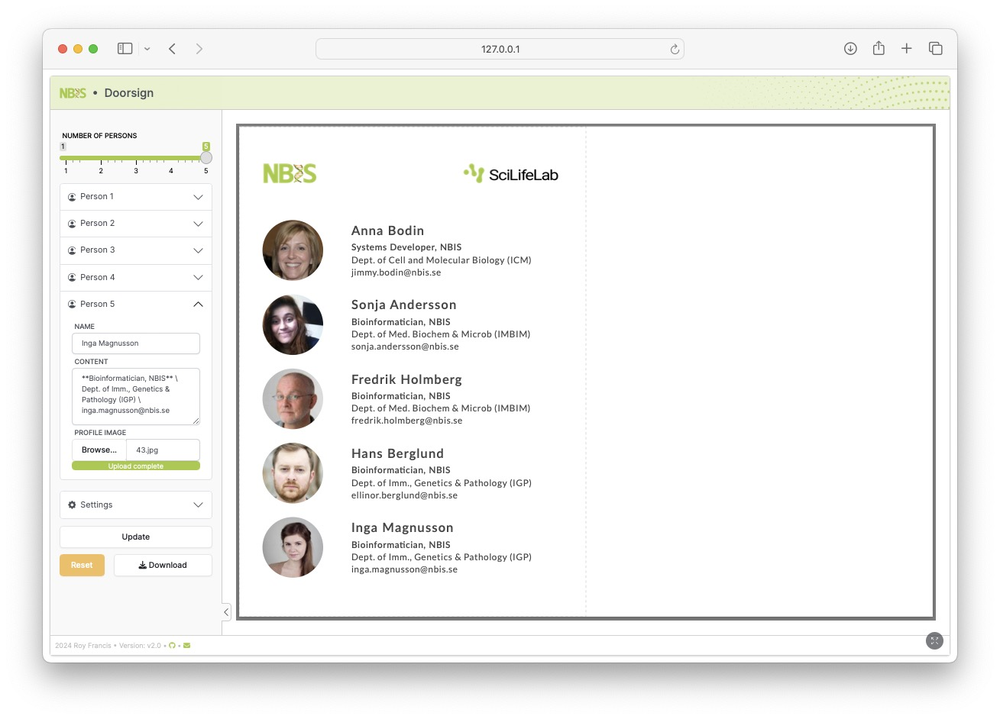

# shiny-doorsign

[](https://github.com/royfrancis/shiny-doorsign/actions?workflow=build) [](https://hub.docker.com/repository/docker/royfrancis/shiny-doorsign)

A web app to create door signage for offices.



## Running the app

### Run online

Click [here](https://door-sign.serve.scilifelab.se/)

### Run in a docker container

```
docker run --platform=linux/amd64 --rm -p 8787:8787 royfrancis/shiny-doorsign
```

The app should be available through a web browser at `http://0.0.0.0:8787`.

---

2024 • Roy Francis
